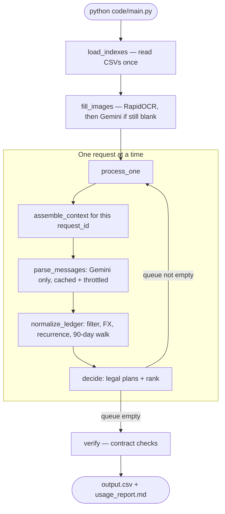

# Buy or Wait? workflow

Shared data load runs once. Each request then walks assemble → facts → ledger → decide **alone** before the next request starts.

**Default model:** `gemini-3.5-flash-lite`. Key: `GEMINI_API_KEY` in `.env`. Calls are spaced 1.0s apart (paid default; set `GEMINI_MIN_INTERVAL_SEC=4.5` on free tier) and cached. 429 retries back off so either tier works. Token use is unchanged.

See `code/decision_engine.md` for the filter and ranking rules.

